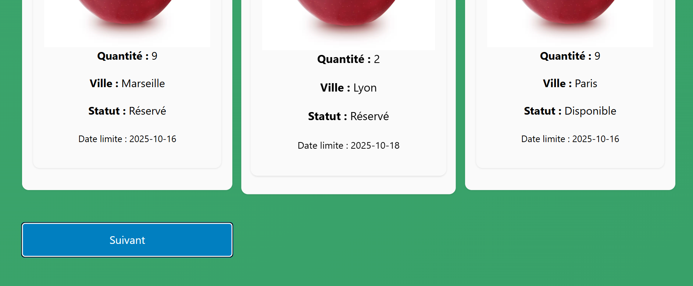

# ReFood – Service Web Anti-Gaspillage Alimentaire

## Choix du sujet

Le gaspillage alimentaire est un enjeu majeur en France. Chaque année, 10 millions de tonnes de nourriture sont jetées, dont 4 millions encore consommables, tandis que 16 millions de personnes vivent avec moins de 3,5 € par jour (source : https://agriculture.gouv.fr/infographie-le-gaspillage-alimentaire). 

En tant qu'étudiants boursiers, ce sujet nous touche particulièrement. C'est pourquoi nous avons choisi de répondre à ces problématiques à travers le projet **ReFood**.

**ReFood** consiste en un service web permettant de mettre en relation locaux donneurs et receveurs d’aliments. Ce choix s’inscrit parfaitement dans les préoccupations écologiques et sociales, tout en favorisant la solidarité de quartier et la consommation responsable.

---

## Utilité sociale

**ReFood** présente une utilité sociale très claire :  

- **Enjeu écologique** : réduction du gaspillage alimentaire, limitation de la surconsommation d’eau, d’énergie, de terres agricoles, et des émissions de CO₂ liées à la production et au transport de nourriture.  

- **Enjeu social** : accès facilité à la nourriture à faible coût ou gratuite, renforcement des liens sociaux locaux.  

Chaque citoyen peut donner ou recevoir des aliments selon ses besoins. Le service favorise le don gratuit et prévoit la possibilité de points de collecte pour limiter les déplacements et optimiser la redistribution.

---

## Effets de la numérisation

La numérisation du partage alimentaire via **ReFood** représente un remplacement des circuits traditionnels comme les associations caritatives physiques, les affichages papier ou encore le bouche-à-oreille. Cette digitalisation apporte plusieurs bénéfices environnementaux et sociaux :

- Géolocalisation en temps réel des dons et demandes.  

- Optimisation des échanges pour réduire le gaspillage et les trajets.  

- Mise en relation instantanée entre donneurs et receveurs, pour accélérer la redistribution avant la date de péremption.  

En revanche, des effets rebonds sont possibles : la surconsommation ou les dérives commerciales. Ces risques sont limités par un encadrement strict du prix, la priorité reste au don gratuit, et des recommandations pour une utilisation responsable.

---

# Scénarios d'utilisation – ReFood

## Scénario 1 : Consulter des items à la une

1. L'utilisateur se rend sur le site depuis ses favoris.  
2. Il consulte un item parmi ceux proposés à la une.  
3. Il revient aux items à la une pour voir les autres propositions.  
4. Il choisit un autre item et le consulte.

## Scénario 2 : Recherche d'items géolocalisés

1. L'utilisateur se rend sur le site depuis ses favoris.  
2. Il effectue une recherche d'items situés à moins de 10 km.  
3. Il clique sur un item trouvé pour consulter ses détails.

---
# Impact de l'exécution des scénarios auprès de différents services concurrents

Nous avons choisi de comparer l’impact des scénarios sur plusieurs services web de don et partage d’aliments : Geev, Donnons.org, ToutDonner.com et JeDonne.fr. Les résultats EcoIndex ont été obtenus via EcoIndexApp, afin d’évaluer l’impact environnemental des pages web les plus consultées et de parcours types.

Service           | Score (sur 100) | Classe    | Détail des mesures
-----------------|----------------|-----------|-------------------
Geev              | 59             | C 🟦      | [..](https://github.com/UTT-GL03/ReFood/blob/main/benchmark/geev.md) 
JeDonne.fr        | 33             | E 🟥      | [..](https://github.com/UTT-GL03/ReFood/blob/main/benchmark/jedonne.md)
Donnons.org       | 14             | F 🟪      | [..](https://github.com/UTT-GL03/ReFood/blob/main/benchmark/donnons.md)
ToutDonner.com    | 71             | B 🟩      | [..](https://github.com/UTT-GL03/ReFood/blob/main/benchmark/toutdonner.md)

**Tab.1 : Mesure de l'EcoIndex moyen des services web étudiés.**

## Analyse
Les mesures de l'impact moyen de ces services (cf. Tab.1) révèlent des **classes EcoIndex très contrastées**.  
- Les pages les plus mal classées (**JeDonne.fr et Donnons.org**) présentent souvent :  
  - un grand nombre de requêtes et scripts tiers,  
  - des pages très volumineuses avec médias non optimisés,  
  - des éléments dynamiques ou publicitaires intensifs.  
- À l'inverse, le bon classement (**ToutDonner.com**) montre qu'il existe une marge de progression significative à condition d'adopter des pratiques d’éco-conception : optimisation des images et vidéos, réduction du nombre de requêtes et d’éléments tiers, et parcours utilisateur simplifiés.  

**Geev**, quant à lui, obtient un score intermédiaire (C 🟦), avec certaines pages optimisées et d'autres encore perfectibles.  

Cette analyse illustre que **ReFood** peut tirer parti de ces bonnes pratiques pour limiter l’impact environnemental de son service web, tout en offrant une expérience utilisateur fluide et efficace.

## Modèle économique

Comme nous l'avons vu dans la section précédente, parmi les choix de conception ayant le plus d'impact environnemental, la plupart sont directement liés au modèle économique du service.  
C'est pourquoi il est nécessaire à ce stade d'analyser leur modèle économique et de définir notre propre modèle permettant une conception plus frugale.

| Service | Visiteur anonyme | Utilisateur inscrit |
|----------|------------------|---------------------|
| **Geev** | Publicités (régie tierce)   Suivi, géolocalisation et cookies analytiques   Accès limité aux annonces sans inscription | Don / récupération d’objets ou de nourriture   Accès complet aux fonctionnalités (messagerie, filtres, favoris)   Système de crédits (« bananes »)   Abonnement *Geev Plus* : suppression des pubs, annonces exclusives, meilleure visibilité |
| **Donnons.org** | Cookies analytiques et publicitaires   Accès libre à la recherche d’objets | Don / récupération d’objets   Création d’un profil public   Accès à la messagerie   Aucun abonnement payant connu |
| **ToutDonner.com** | Site sans publicité apparente   Pas de suivi détecté   Accès rapide sans inscription obligatoire | Don / récupération d’objets   Messagerie simple après connexion   Interface légère et peu consommatrice |
| **JeDonne.fr** | Cookies standards (statistiques et performance)   Pas de publicités visibles sur les pages | Don / récupération d’objets   Accès complet après inscription (profil + messagerie) |

**Tab. 2 : Offre des services de dons alimentaires et matériels.**

Les modèles de ces plateformes reposent en majorité sur un accès gratuit, financé par publicité et par la valorisation de données.  
Geev est le cas le mieux documenté de **modèle mixte gratuit + abonnement**, avec une offre Premium sans publicité.  

À l’inverse, **ToutDonner** et **JeDonne.fr** se distinguent par une approche plus sobre : peu ou pas de suivi publicitaire, interface allégée et accès simplifié.  
**Donnons.org** ont un positionnement intermédiaire, sans abonnement ni publicité intrusive, mais avec un suivi analytique classique (cookies et statistiques).

### Sources de revenus possibles

| Source de revenus | Montant unitaire estimé | Quantité nécessaire pour financer un salaire [^salaire] |
|--------------------|------------------------|----------------------------------------------|
| Publicité (régie tierce) | 0,00046 € [^rpm] | ~7 800 000 vues |
| Abonnement premium (Geev Plus) |  2 € / mois [^geev] | 1 800 abonnés |
| Dons / contributions volontaires | 5 € [^helloasso] |  800 donateurs |
| Publicité intégrée | 10 000 € [^encart] | 0,35 campagnes |

[^salaire]: Basé sur le coût total employeur du salaire médian 2025, soit 3569 € environ (source : [URSSAF](https://mon-entreprise.urssaf.fr/simulateurs/salaire-brut-net)).  
[^rpm]: Estimation moyenne du revenu pour mille vues (CPM) sur les régies tierces type Google AdSense : 0,46 € / 1000 vues (source : [AdCPMRates](https://adcpmrates.com/2022/09/07/adsense-cpm-and-cpc-rates-in-germany-2023/)).  
[^geev]: Basé sur le tarif d’abonnement **Geev Plus** : 1,99 € / mois sur le [Google Play Store](https://play.google.com/store/apps/details?id=com.geev.geevapp).  
[^helloasso]: Estimation issue des contributions moyennes observées sur des plateformes de dons solidaires comme [HelloAsso](https://www.helloasso.com/) ou [Wikipédia](https://donate.wikimedia.org/).  
[^encart]: Montant indicatif d’une campagne sponsorisée solidaire ou municipale (10 000 €) estimé d’après les tarifs d’encarts locaux et les partenariats associatifs courants.

**Tab. 3 : Sources de revenus possibles pour les services de dons en ligne.**  
\*Estimations indicatives basées sur des moyennes du secteur.

L’étude des plateformes montre que :
- le recours à une régie publicitaire tierce accroît l’empreinte environnementale (requêtes externes, scripts, vidéos, cookies) ;
- les modèles basés sur les abonnements ou dons sont plus sobres, car ils n’impliquent ni traqueurs ni appels à des serveurs publicitaires ;
- une interface épurée et sans publicité (comme sur ToutDonner) contribue directement à un meilleur score d’éco-conception (EcoIndex plus élevé).

Donc afin de réduire l’impact écologique tout en assurant la viabilité du service, nous proposons de :
- renoncer aux publicités gérées par des régies tierces ;
- adopter un modèle reposant sur **les dons volontaires** ou **un abonnement symbolique** (1 € / mois) ;
- privilégier une régie publicitaire intégrée, avec des visuels légers et limités aux partenaires solidaires ;
- réduire le suivi utilisateur au strict minimum (cookies essentiels uniquement) ;
- favoriser une conception technique économe : pages statiques, et compression des médias.

---

## Maquette de l'interface et échantillon de données

Au vu des différents services comparés, des exigences environnementales exprimées plus haut et des scénarios retenus, nous avons défini pour notre prototype une maquette de l'interface et un échantillon de données réalistes.

Les ressources Web représentées dans notre application ReFood sont de deux types principaux : offres de nourriture et utilisateur.

- Chaque offre représente un don alimentaire proposé par un utilisateur.
Elle contient un titre, une description, une quantité, un type d’aliment, un état (frais, surgelé, etc.), une ville et une date limite de validité. URI : /offres pour toutes les offres /offres/{id} pour une offre spécifique.

- Chaque utilisateur correspond à une personne ou une structure (association, commerce, particulier) qui publie ou consulte des offres. URI : /utilisateurs/{id}

*Fig.1: Maquette de l'interface du prototype - à droite : type de une du site avec des offres, à gauche : type de page d'une offre.*

Pour des raisons de respect des droits d’auteur, nous utilisons des données générées avec dummy-json. Bien que fictives, ces données respectent la structure des services des services concurrents (voir [modèle de données](https://github.com/UTT-GL03/ReFood/blob/main/sample_data.hbs)).
---
## Prototype n°1 : Fonctionnalités pour le scénario prioritaire avec données chargées de manière statique

### Objectif 

Ce premier prototype nous permet de répondre à notre scénario prioritaire : Consulter des offres de don de nourriture depuis la page d'accueil 
Les données sont chargés de manière statique.

### Page d'acceuil 

La page d'accueil de notre prototype affiche actuellement des offres de dons alimentaires aléatoires, basées sur un jeu de données statiques.

*Fig. 2 — Page d’accueil de Refood*

Nous avons opté pour PicoCSS, un framework CSS minimaliste, en raison de sa faible empreinte, ce qui le rend idéal pour cette phase de test. 

Nous avons fait le choix de ne pas intégrer de photos dans la page principale présentant les annonces. Même si les images peuvent renforcer l’attractivité des publications, elles ne sont pas essentielles à la consultation des informations clés (type de denrée, quantité, ville, statut, date limite). Leur absence permet ainsi de réduire considérablement le nombre de requêtes HTTP et la taille totale de la page, deux facteurs ayant un impact direct sur la consommation énergétique du chargement.

Cependant nous pensons que des photo devrait être ajoutée ultérieurement, pour cela il serait nécessaire de pondérer son intérêt fonctionnel avec son impact environnemental, potentiellement élevé. En effet, sauf recours à des optimisations avancées (comme les sprites CSS ou le multiplexage HTTP/2), chaque image requiert un transfert de données supplémentaire.

Dans l’état actuel du prototype, il est donc déjà possible d’obtenir une estimation représentative de l’impact environnemental du frontend. Bien que les données ne soient pas encore chargées dynamiquement, nous pouvons mesurer la consommation associée au rendu des données statiques et à la pile technique retenue (React, PicoCSS, DayJS).

Mode | Ecoindex | GES (gCO2e) | taille du DOM | Requêtes | taille de la page (ko)
|---|---|---|---|---|---
| Développement | 74 B 🟠 | 1.61 | 359 | 29 | 1775
| Pré-Production | 82 A 🟢 | 1.37 | 355 | 5 | 344 

*Tab. 4 — Évaluation de l'impact du prototype de la page d'accueil.*

### Pages des offres
Les pages des offres ont pour HTTP-URI offre/{id}. 

Bien que nous ayons suivi la maquette pour la conception des pages d'offres, la version actuelle est incomplète. Notamment, les photos ne sont pas encore intégrées, de même que de nombreuses fonctionnalités qui seront ajoutées ultérieurement.

*Fig. 3 — page d'une offre.*

| Scénario | EcoIndex | GES (gCO2e) | Taille du DOM | Requêtes | Taille de la page (ko) |
|---|---|---|---|---|---|
| 1. Consulter la page des offres | 82 A 🟢 | 1.37 | 355 | 5 | 344 |
| 2. Choisir une offre et la charger | 95 A 🟢 | 1.10 | 31 | 5 | 344 |
| 3. Revenir à l'accueil et consulter à nouveau la page des offres | 82 A 🟢 | 1.37 | 355 | 5 | 344 |
| 4. Choisir une nouvelle offre | 95 A 🟢 | 1.10 | 31 | 5 | 344 |

**Tab.5: Évaluation de l'impact du scénario "Consulter des offres" dans le prototype n°1.** 

Bien que nos estimations actuelles soient faussées à la baisse à cause des données statiques, elles restent comparables à celles de nos concurrents.
Avec une moyenne concurrente de 1,95 g par page, notre objectif de rester sous 1,40 g représente déjà une amélioration significative.

## Etape de prototypage : Données statiques chargées de manière dynamique

La version 1.0.1 du prototype, bien qu'identique fonctionnellement, adopte un chargement de données plus réaliste. Les données sont toujours statiques mais sont désormais récupérées par le frontend via le réseau après l'affichage initial de la page, ce qui a eu pour effet d'ajouter 1 seul requête supplémentaire.

Donc pour l'évaluation de ce scénario, les résultats sont globalement identiques à ceux du Tab.2, hormis le nombre de requêtes qui augmente donc de 1.

## Mesures de la consommation énergétique lors du passage à l'échelle

Maintenant que notre prototype est réaliste en termes de nombre de requêtes, nous pouvons simuler les effets du "passage à l'échelle".

Sur une plateforme de dons alimentaires comme ReFood, plusieurs types de données s’accumulent naturellement avec le temps. Le volume principal provient des offres créées par les utilisateurs. Chaque offre comprend des informations textuelles (titre, description, catégorie, dates, utilisateur) et souvent une image. Même après que l’offre soit récupérée ou annulée, elle reste dans l’historique pour permettre l’analyse des tendances, le suivi des dons passés et l’optimisation des futures offres.

Si on se base sur une moyenne de 40 nouvelles offres par jour, on peut estimer une croissance comme environ 7300 offres après 6 mois dans notre base de données.

Les utilisateurs constituent un autre type de données qui croît régulièrement au fil du temps. En supposant qu’environ 30 nouveaux utilisateurs s’inscrivent chaque mois, on obtient 360 nouveaux utilisateurs par an.

---
## Evolution de l'Ecoindex lors du passage à l'échelle 

Les mesures utilisées pour calculer l’EcoIndex sont désormais générées automatiquement dans le cadre du processus d’intégration continue.

| Scénario | EcoIndex | GES (gCO2e) | Taille du DOM | Requêtes | Taille de la page (ko) |
|---|---|---|---|---|---|
| 1. Consulter la page des offres | <del>82 A 🟢</del> 39 E 🔴 | <del>1.37</del> 2.20 | <del>355</del> 54 015 | <del>5</del> 7 | <del>344</del> 1 882 |
| 2. Choisir une offre et la charger | <del>95 A 🟢</del> 86 A 🟢 | <del>1.10</del> 1.13 | <del>31</del> 35 | <del>5</del> 6 | <del>344</del> 1 881 |
| 3. Revenir à l'accueil et consulter à nouveau la page des offres | <del>82 A 🟢</del> 52 D 🟡 | <del>1.37</del> 1.95 | <del>355</del> 54 015 | <del>5</del> 0 | <del>344</del> 0 |
| 4. Choisir une nouvelle offre | <del>95 A 🟢</del> 94 A 🟢 | <del>1.10</del> 1.13 | <del>31</del> 35 | <del>5</del> 6 | <del>344</del> 0 |

**Tab. 6: Ecoindex après passage à l'echelle**

La baisse de l’EcoIndex est nettement plus marquée pour la page listant les offres que pour la page d’une offre. Cela s’explique par la nature même de l’EcoIndex, qui évalue l’impact environnemental global d’une page, plus une page contient d’éléments, plus cette part augmente.

## Mesure de la consommation énergétique liée à la consultation

Nous pouvons utiliser l'utilitaire GreenFrame qui permet de calculer et d'estimer la consommation energétique de notre service sur la base de plusieurs composants comme:

- du CPU (à partir du temps de calcul),
- de la mémoire vive (à partir de la taille des données mémorisées),
- du disque (à partir de la taille des données lues et écrites),
- du réseau (à partir de la taille des données reçues et envoyées),
- pour le navigateur uniquement, de l'écran (à partir du temps d'exécution du scénario).

| Consulter la page d'accueil des offres        | CPU (Wh) | Mémoire (Wh) | Disque (Wh) | Réseau (Wh) | Écran (Wh) | Total (Wh) |
|------------------|----------|--------------|-------------|-------------|------------|------------|
| **Navigateur**   | 0.0024   | 0.00011      | 0.0         | **0.059**   | **0.11**   | 0.12       |
| **Serveur Web**  | 0.000025 | 0.0000046    | 0.0         | **0.059**   | 0.0        | 0.064      |

| Consulter une offre        | CPU (Wh)   | Mémoire (Wh) | Disque (Wh) | Réseau (Wh) | Écran (Wh) | Total (Wh) |
|------------------|------------|--------------|-------------|-------------|------------|------------|
| **Navigateur**   | 0.0014     | 0.000078     | 0.0         | **0.059**   | **0.069**   | 0.13       |
| **Serveur Web**  | 0.000025   | 0.0000029    | 0.0         | **0.059**   | 0.0        | 0.062      |

**Tab. 7: Mesure de la consommation énergétique pour nos 2 scénarios**
## Introduction d'une base de donnée

Afin de réduire l'impact énérgétique du réseau, nous stockons désormais les données de l'application (on a une v2.0.0) dans une base de données (CouchDB). Cette évolution nous permet, lors de l'affichage d'une offre, de charger une seule offre plutôt que 3000.

|                    | cpu (s) | screen (s) | mem (B) | disk (B) | network (B) |
| ------------------ | -------- | ---------- | -------- | -------- | ----------- |
| Navigateur  | 0.0392| 17.4 | 1.11e+8 | 0.00 | 2.18e+3 |
| Serveur Web  | 0.0000662 | 0.00 | 5.58e+6| 0.00 | 2.05e+3 |
| Base de données | 0.0479| 0.00 | 8.40e+7 | 0.00 | 0 |

**Tab.8 : Effet sur l’utilisation des ressources suite à l’introduction d’une base de données, lors de la consultation d’une offre.**

On remarque une amélioration correcte grâce à cette ajout mais aussi un ajout de consommation electrique due à la base de données mais qui est plutôt faible. 

| (Consulter l'index)               | CPU (Wh)                              | Mémoire (Wh)                          | Disque (Wh) | Réseau (Wh)                              | Écran (Wh)               | Total (Wh)                              |
| ----------------- | -------------------------------------- | -------------------------------------- | ----------- | ------------------------------------------ | ------------------------- | ---------------------------------------- |
| **Navigateur**    | <del>0.0024</del> 0.001          | <del>0.00011</del> 0.000049        | 0.0         | <del>0.059</del> 0.0002             | <del>0.11  </del> 0.065 | <del>0.12</del> 0.068               |
| **Serveur Web**   | <del>0.000025</del> 0.0000058      | <del>0.0000046</del> 0.0000028     | 0.0         | <del>0.059</del> 0.0019             | 0.0                       | <del>0.064</del> 0.0019           |
| **Backend**       | <del>0</del> 0.00073                                   | <del>0</del> 0.000048                                    | 0.0           | <del>0</del> 2.1e-7                                        | 0.0                        | <del>0</del> 0.00084                                       |

| Consulter une offre              | CPU (Wh)                              | Mémoire (Wh)                          | Disque (Wh) | Réseau (Wh)                              | Écran (Wh)                | Total (Wh)                              |
| ----------------- | -------------------------------------- | -------------------------------------- | ----------- | ------------------------------------------ | -------------------------- | ---------------------------------------- |
| **Navigateur**    | <del>0.0014</del> 0.0010          | <del>0.000078</del> 0.000041       | 0.0         | <del>0.059</del> 0.000011             | <del>0.69</del> 0.068  | <del>0.13</del> 0.068               |
| **Serveur Web**   | <del>0.000025</del> 0.0000012      | <del>0.0000029</del> 0.0000029     | 0.0         | <del>0.059</del> 0.000010             | 0.0                        | <del>0.062</del> 0.000015           |
| **Backend**       | <del>0</del> 0.00084               | <del>0</del> 0.000043              | 0.0         | <del>0</del> 0                        | 0.0                        | <del>0/del> 0.00088                |

**Tab.9 : Effet sur l’utilisation des ressources suite à l’introduction d’une base de données pour nos deux scénarios.**

## Stratégie de limitation du nombre d'éléments affichés

Dans une application de dons ou de ventes alimentaires de type Leboncoin, les utilisateurs publient de nouvelles annonces de manière continue au cours de la journée. Afficher l’ensemble des offres existantes à chaque visite serait coûteux en termes de transfert de données, de temps de chargement et d’impact environnemental.

Pour améliorer les performances tout en préservant une expérience utilisateur cohérente, nous limitons donc le nombre d’offres affichées simultanément sur la page d’accueil.

Deux stratégies étaient envisageables :

- afficher uniquement les offres publiées aujourd’hui,

- afficher les n dernières offres publiées, indépendamment de la date.

Nous avons ainsi choisi d’afficher les 21 offres les plus récentes, ce qui présente plusieurs avantages :

- réduire le volume de données transférées entre le serveur et le navigateur ;
  
- diminuer la charge de calcul côté serveur ;
  
- améliorer les temps d’affichage pour les utilisateurs ;

L’application permettra à l’utilisateur de charger progressivement davantage d’offres, afin de pouvoir consulter les publications plus anciennes à la demande, sans surcharger l’affichage initial.

*Fig. 4 — Chargement progressif (à la demande) des offres .*

| Composant | CPU (Wh) | Mémoire (Wh) | Disque (Wh) | Réseau (Wh) | Écran (Wh) | Total (Wh) |
|-----------|----------|--------------|-------------|-------------|------------|------------|
| **Navigateur** | 0.0010 | <del>0.00049</del> 0.000047 | 0.0 | 0.002 | <del>0.065</del> 0.068 | 0.068 |
| **Serveur Web** | <del>0.0000058</del> 0.0000053 | 0.0000029 | 0.0 | 0.0019 | 0.0 | 0.0019 |
| **Backend** | <del>0.00073</del> 0.00071 | 0.000048 | 0.0 | 2.1e-7 | 0.0 | <del>0.00082</del> 0.00075 |

**Tab.10 : Effet sur l’utilisation des ressources de la consultation de l'index suite à la limitation d'affichage de données.**

L'implémentation de la stratégie de limitation (v2.0.1) ne change pas grand chose mais on remarque que la consommation électrique de l'ensemble des composants se retrouve réduite quasiment à celle de l'écran.

En l'état, la consommation électrique est constante par rapport à la volumétrie des offres, et à un niveau si bas que la part due au CPU, à la mémoire et au réseau est négligeable par rapport à celle de l'écran.

## Intégration des images à la base de données

Jusque là, nous hésitions à inclure des images à ReFood afin de maintenir une empreinte écologique minimale. Toutefois, pour une plateforme d’offres alimentaires, l'aspect visuel est indispensable à l'expérience utilisateur et à la valorisation des produits.

Afin d’améliorer la pertinence de nos mesures, un champ « image » a été ajouté aux documents « offre » de la base de données. Chaque offre référence désormais une image distincte via une URL déterministe. Cette méthode permet de simuler un cas d’usage réaliste sans alourdir le stockage de la base de données, tout en permettant une analyse plus fidèle de l’impact environnemental lié au transfert des ressources médias.

| Composant | CPU (Wh) | Mémoire (Wh) | Disque (Wh) | Réseau (Wh) | Écran (Wh) | Total (Wh) |
| :--- | :---: | :---: | :---: | :---: | :---: | :---: |
| **Navigateur** | <del>0.001</del> 0.0019 |<del>0.00049</del> 0.000072 | 0.0 | <del>0.02</del> 0.037 | 0.068 | <del>0.065</del> 0.11 |
| **Serveur Web** | <del>0.0000053</del> 0.000029 | <del>0.0000029</del> 0.0000028 | 0.0 | <del>0.0019</del> 0.037 | 0.0 | <del>0.0019</del> 0.037 |
| **Backend** |0.00071 | 0.000048 | 0.0 | 2.1e-7 | 0.0 | <del>0.00075</del> 0.00084 |

On remarque forcément une hausse de consommation sur l'ensemble, passant d'une empreinte estimée de 73.77 mWh à 144.101 mWh soit une augmentation de 100% de la consommation. Cependant, il nous est compliqué de renoncer à l'ajout d'images.  

## Amélioration
